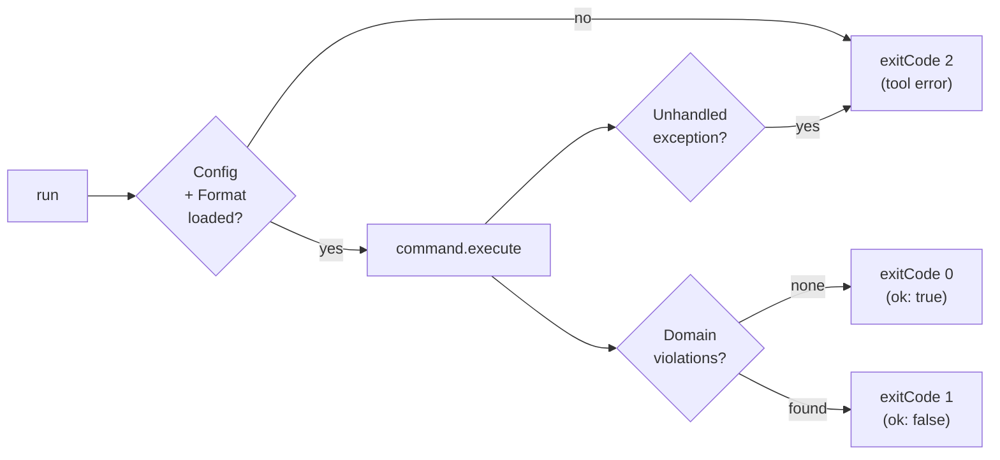
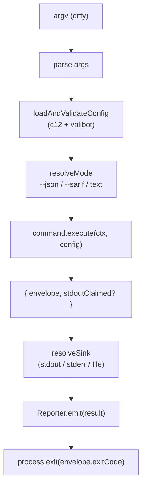

# CLI

The CLI layer is aact's **public output contract**. Every command —
`check`, `analyze`, `diff`, `generate`, `model`, `rule`, `init`,
`skill`, `view` — funnels through one envelope shape (`CliEnvelope`)
and three reporters (Human / JSON / SARIF). CI parsers, AI-agent
loops, and IDE plugins lock onto the envelope, not the text — the
text rendering may change between minor versions, the envelope shape
does not.

A new command ships by writing one execute function and one text
renderer. Argument parsing, config loading, model loading, envelope
construction, reporter dispatch, error handling, exit-code mapping —
all of that is shared infrastructure.

## The envelope

```ts
interface CliEnvelope<TData = unknown> {
  readonly schemaVersion: 1;
  readonly command: string;
  readonly ok: boolean;
  readonly exitCode: 0 | 1 | 2;
  readonly data: TData;
  readonly diagnostics: readonly Diagnostic[];
  readonly meta: EnvelopeMeta;
}
```

| Field           | Notes                                                                                                                                                     |
| --------------- | --------------------------------------------------------------------------------------------------------------------------------------------------------- |
| `schemaVersion` | **Stable contract version**. Frozen at `1` through GA. Additions to per-command `data` shapes are non-breaking; renames or removals bump `schemaVersion`. |
| `command`       | Name of the invoked command: `"check"`, `"analyze"`, `"diff"`, `"generate"`, `"model"`, `"rule.list"`, `"rule.explain"`, `"init"`, `"skill"`, `"view"`.   |
| `ok`            | `true` when nothing surfaced — clean run.                                                                                                                 |
| `exitCode`      | `0` clean / `1` domain violations / `2` tool error. See exit-code contract below.                                                                         |
| `data`          | Per-command shape (`CheckData`, `AnalyzeData`, `DiffData`, …). All shapes typed in `src/cli/commands/<name>.ts` and re-exported from `src/index.ts`.      |
| `diagnostics`   | `Diagnostic[]` — typed warnings / info messages that don't affect exit code but the user should see (loader warnings, deprecation hints).                 |
| `meta`          | `aactVersion`, `durationMs`, `configPath`, `source` — informational context every consumer wants for logging.                                             |

`data` is `null` on tool errors (`exitCode: 2`) — the spec-canonical
SARIF mapping is `invocations[].toolExecutionNotifications[]`, JSON
mode shows the diagnostics-only envelope, text mode shows a single
red banner.

## `schemaVersion` freeze policy

`schemaVersion` is the **stable public-contract marker** — locked at
`v3.0.0` GA. During `3.0.0-beta.X` we reserve the right to remove or
rename fields under `schemaVersion: 1` without bumping; breaking
changes within beta are documented in `CHANGELOG.md` only. Bumping
`schemaVersion` mid-beta would dilute its meaning. Consumers pinning
to `aact@beta` must read the CHANGELOG for shape changes; consumers
on `aact@latest` (post-GA) can rely on `schemaVersion` for
backward-compat detection.

Post-GA, the rule is: **additive only**. New per-command fields,
new `DiagnosticKind` literals, new reporter formats — all
non-breaking under `schemaVersion: 1`. Removals, renames, or
semantic-meaning changes bump to `schemaVersion: 2` and ship as a
major version of aact.

## Diagnostics

```ts
interface Diagnostic {
  readonly kind: DiagnosticKind;
  readonly message: string;
  readonly severity: "warning" | "info";
  readonly context?: Readonly<Record<string, string>>;
}
```

`DiagnosticKind` is a closed string-literal union — every diagnostic
the CLI surfaces has a typed key. The taxonomy is grouped by source
subsystem:

| Prefix       | Examples                                                                                      | Where it comes from                             |
| ------------ | --------------------------------------------------------------------------------------------- | ----------------------------------------------- |
| `model.*`    | `model.danglingRelation`, `model.boundaryCycle`, `model.parseError`, `model.loaderWarning`    | `validateModel` + loaders                       |
| `config.*`   | `config.unknownRule`, `config.loadFailed`, `config.invalidSchema`, `config.invalidCustomRule` | `loadAndValidateConfig`                         |
| `format.*`   | `format.unsupportedFix`, `format.missingWritePath`, `format.unknown`                          | Format dispatch + `--fix` capability checks     |
| `fix.*`      | `fix.editConflict`                                                                            | `applyEdits` overlap detection                  |
| `skill.*`    | `skill.unmanagedDir`, `skill.repoMismatch`                                                    | `aact skill install` safety guards              |
| `view.*`     | `view.companionMissing`, `view.bootFailed`                                                    | `aact view` companion-package machinery         |
| `internal.*` | `internal.unexpected`                                                                         | Catchall for bugs that should never reach users |

Adding a new diagnostic = one literal in the `DiagnosticKind` union
in [`output/types.ts`](./output/types.ts). Renaming an existing one
is breaking — consumers may switch on `kind` to filter or escalate.

## Exit-code contract



- **`0`** — clean run. No violations, no errors. CI gates pass.
- **`1`** — domain violations found (rule violations from `check`,
  changes detected by `diff` in fail-on-change mode, etc.).
  Configuration / format / source files are fine; the linter just
  found things to report. CI shell `if`s on this.
- **`2`** — tool error. Config invalid, source missing, parse failed,
  unhandled internal exception. The command **did not finish its
  work**. `data: null` in the envelope; diagnostics carry the
  failure detail.

Agents must branch on these — do not collapse `1` and `2` into
"non-zero is bad". A clean-but-violating run looks identical to a
broken pipeline if you do.

## Reporters

Three target formats, one envelope:

```mermaid
flowchart LR
  Cmd[command.execute] --> Env["CliEnvelope&lt;TData&gt;"]
  Env --> Mode{--json /<br/>--sarif /<br/>(default text)}
  Mode -- "text" --> Human["HumanReporter<br/>(renderText + OSC 8 hyperlinks)"]
  Mode -- "--json" --> Json["JsonReporter<br/>(stringify envelope)"]
  Mode -- "--sarif" --> Sarif["SarifReporter<br/>(SARIF v2.1.0)"]
  Human --> Stdout1[stdout / stderr*]
  Json --> Stdout2[stdout]
  Sarif --> Stdout3[stdout]
```

\*HumanReporter writes to **stderr** when the command claimed stdout
for an artefact (`generate --output -`); JSON / SARIF would have
rejected the stdout collision upfront with a `config.outputCollidesWithJson`
diagnostic.

| Reporter        | When                                                   | Stable surface                                                                                                          |
| --------------- | ------------------------------------------------------ | ----------------------------------------------------------------------------------------------------------------------- |
| `HumanReporter` | default                                                | Plain text per command + OSC 8 hyperlinks. Format is **not** part of the public contract — tunable across minors.       |
| `JsonReporter`  | `--json` flag                                          | `JSON.stringify(envelope, null, 2)` — full envelope, no extra wrapping. **Stable**.                                     |
| `SarifReporter` | `--sarif` flag (only on commands that produce results) | SARIF v2.1.0 with `result.relatedLocations[]`, `invocations[].toolExecutionNotifications[]` on tool errors. **Stable**. |

Each command supplies a `Renderer<TData>` text function; the
JSON/SARIF reporters are command-agnostic (they consume the envelope
shape uniformly).

## OSC 8 terminal hyperlinks

`HumanReporter` emits OSC 8 escape sequences so file:line:col anchors
become Cmd-clickable in supported terminals. Behaviour adapts to the
terminal:

| Terminal                                | Click target                                  |
| --------------------------------------- | --------------------------------------------- |
| VSCode / Cursor integrated terminal     | jumps to line:col in editor (host handles it) |
| Zed integrated terminal                 | plain text (Zed has its own path autodetect)  |
| Ghostty / iTerm2 / WezTerm / Kitty etc. | `<scheme>://file/<abs>:line:col`              |
| Piped / non-TTY (`jq`, `> log.txt`, CI) | plain text — no escapes                       |

The scheme for non-VSCode terminals comes from the `AACT_FILE_OPENER`
environment variable: `vscode` (default), `vscode-insiders`, `cursor`,
`windsurf`, `zed`, or `none`. Same vocabulary as OpenAI Codex's
`file_opener` setting.

## How a command runs end-to-end



- **Config loading** uses [`c12`](https://github.com/unjs/c12) to
  discover `aact.config.ts` upward from cwd. [`valibot`](https://valibot.dev)
  validates the shape; `config.invalidSchema` diagnostic surfaces
  on failure (no thrown stack trace at the user).
- **Mode resolution** picks one of `text` / `json` / `sarif`. JSON
  and SARIF can't share stdout with `generate --output -` — the
  guard fires before the command runs.
- **Command execute** returns
  `{ envelope, stdoutClaimed?: boolean }`. Pure as far as the
  CLI infrastructure is concerned — the command produces data, the
  reporter chooses how to render.
- **Exit code** comes from `envelope.exitCode`. The runner
  `process.exit(code)` after the reporter finishes flushing.

## Adding a new command

End-to-end checklist:

1. **Define the data shape.** Add `<Cmd>Data` interface to
   `src/cli/commands/<cmd>.ts`. Export it from
   [`src/index.ts`](../index.ts) so users-as-library can consume the
   envelope from outside the CLI.

2. **Write the execute function.**

   ```ts
   export const executeFoo = async (
     config: AactConfig,
   ): Promise<ExecuteResult<FooData>> => {
     // ...do work...
     return {
       data,
       exitCode: 0,
       diagnostics: [],
     };
   };
   ```

3. **Write the text renderer.**

   ```ts
   export const renderFooText: Renderer<FooData> = (envelope, sink) => {
     sink.write(`...\n`);
   };
   ```

4. **Wire via `cliCommandWithConfig`.**

   ```ts
   export const foo = cliCommandWithConfig({
     name: "foo",
     meta: { name: "foo", description: "..." },
     args: { ...configArg, ...jsonArg /* + your args */ },
     renderText: renderFooText,
     execute: (_ctx, config) => executeFoo(config),
   });
   ```

   Config loading, mode resolution, envelope construction, error
   handling, exit code propagation — all handled by
   `cliCommandWithConfig`.

5. **Register the subcommand** in
   [`src/cli/index.ts`](./index.ts).

6. **Tests.**
   - `test/cli/commands/<cmd>.test.ts` — unit tests on `executeFoo`
     without going through citty.
   - `test/e2e/<cmd>.e2e.test.ts` — subprocess invocation against
     `dist/cli/index.mjs` in a tmpdir, for envelope shape +
     stdout/stderr/exit-code assertions.

7. **CHANGELOG.** Add an entry under `## Unreleased` describing the
   new command and its data shape.

## Stability guarantees

- **Adding per-command `data` fields** is non-breaking. Consumers
  must ignore unknown keys (standard JSON parsing practice).
- **Adding new `DiagnosticKind` literals** is non-breaking. Consumers
  switching on `kind` must have a default branch — see existing
  reporter patterns.
- **Adding new commands** is non-breaking.
- **Adding new reporter formats** (e.g. a future
  `--output github-actions`) is non-breaking.
- **Renaming `data` fields** or **renaming `DiagnosticKind` literals**
  is breaking. Bumps `schemaVersion` post-GA.
- **Changing `exitCode` semantics** (e.g. mapping a domain violation
  to `2`) is breaking. CI gates rely on the 0/1/2 split.

The CLI envelope is the **most user-facing public contract** in
aact — even before users read the Model or Format types, they parse
the envelope from `aact check --json`. Treat it as locked.
