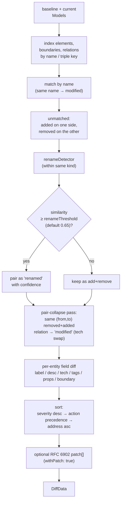

# Diff

`computeDiff(baseline, current, options?)` — pure-function structural
diff between two `Model` snapshots. Used by `aact diff` for PR
review and exposed in the public API for library consumers who want
to drive their own change reports (commit hooks, dashboards,
agent loops).

The output is **domain-grouped**: a Terraform-style change log
listing every entity that moved (added / removed / modified /
renamed / moved) plus the specific fields that changed. An
opt-in RFC 6902 `patch[]` rides along when consumers need raw JSON
ops.

## What it produces

```ts
function computeDiff(
  baseline: Model,
  current: Model,
  options?: DiffOptions,
): DiffData;

interface DiffData {
  readonly summary: DiffSummary;
  readonly changes: readonly Change[];
  readonly groups?: readonly ChangeGroup[];
  readonly patch?: readonly JsonPatchOp[];
  readonly baseline: DiffSide;
  readonly current: DiffSide;
}
```

```ts
type Change = ElementChange | BoundaryChange | RelationChange | WorkspaceChange;
type ChangeAction = "added" | "removed" | "modified" | "renamed" | "moved";
type ChangeSeverity = "structural" | "semantic" | "cosmetic";
```

Each `Change` carries:

- **`address`** — stable cross-reference ID (`element:api`,
  `relation:web→api`, `boundary:platform`). Mirrors Terraform's
  `address` convention; lets logs and PR comments link to a
  specific change without ambiguity.
- **`severity`** — `structural` / `semantic` / `cosmetic`.
  Drives default rendering and CI gate behaviour.
- **`fields`** — `FieldChange[]` with `before` / `after` / set
  delta for array fields (`added` + `removed` lists computed
  once so consumers don't re-derive).
- **`confidence`** (on rename actions only) — similarity score
  from the rename detector. Agents gate on it to filter
  low-confidence guesses.

`changes[]` is the source of truth. Optional `groups[]` is reserved
for higher-level architectural interpretations over the same primitive
changes; `patch[]` is the machine-applied JSON Patch layer.

## Severity taxonomy

| Severity     | Examples                                                                                                                   |
| ------------ | -------------------------------------------------------------------------------------------------------------------------- |
| `structural` | Added / removed elements, boundaries, relations. Moves between boundaries. Kind transitions (`Container` → `ContainerDb`). |
| `semantic`   | Technology / external / tags / order / properties changes. Same-`(from,to)` technology swap on a relation.                 |
| `cosmetic`   | Label, description, sprite, link, workspace metadata.                                                                      |

The heuristic is **not configurable** — kept neutral on purpose so
"this change is structural" means the same thing on every aact
install. Consumers that want a different cut filter on
`change.severity` themselves.

## How the diff is computed

The v3 algorithm is tuned for **20-300 containers/components across
multiple C4 levels**. That size is large enough that hand-reviewing
PlantUML / DSL / JSON text diffs becomes noisy, but small enough that
deterministic bipartite matching is cheap. The engine intentionally
does **not** use exact Graph Edit Distance as its runtime core: GED is
useful as a research oracle, but it is NP-hard and too unpredictable
for a CLI/CI command that should return quickly on every PR.

The accepted architecture is:

1. **Normalize first.** Every input format is loaded into the same
   `Model` shape. The differ never compares syntax, indentation, PUML
   macro style, DSL ordering, or source locations.
2. **Anchor by identity.** Elements and boundaries with the same name
   match directly. Relations match as a multiset on
   `(from, to, technology)`, so repeated dynamic-view steps and
   parallel transports survive.
3. **Match unmatched nodes by role-aware similarity.** Removed and
   added elements are only paired within the same C4 `kind`. The
   current v3 score combines name, label, technology, external flag,
   tags, outgoing relation overlap, description, and properties, then
   solves the pairing globally with Hungarian assignment instead of
   greedy local matching.
4. **Converge chain renames.** Element rename detection runs in a
   fixed-point loop. Newly discovered renames remap relation targets
   for the next iteration, which lets chain refactors converge without
   surfacing every intermediate edge as add/remove noise.
5. **Remap relations after renames.** Relation identities are compared
   through the final `oldName → newName` map, so edges touching renamed
   elements keep their semantic continuity.
6. **Collapse obvious semantic edits.** A removed+added relation pair
   with the same `(from, to)` becomes one `modified` relation with
   `field: "technology"`, not two unrelated structural changes.
7. **Emit primitive changes first.** `changes[]` remains the stable
   public contract: deterministic, domain-grouped, sortable, and easy
   to gate in CI.
8. **Group without replacing primitives.** Architecture operations
   such as `introducedRepository`, `introducedGateway`, `syncToAsync`,
   `splitElement`, or `extractedBoundary` are optional `groups[]` over
   existing `changes[]`, not a replacement for the primitive diff.



Three notable design choices:

1. **Rename detection by similarity, within same kind only.** A
   `Container` won't rename into a `Person` — kinds are anchors.
   Score combines name (Levenshtein-normalised), label, technology,
   external flag, tags, outgoing-relation overlap, description, and
   properties. Default threshold `0.65`; `disableRenameDetection: true`
   skips the heuristic entirely and surfaces pure add/remove pairs.

2. **Multiset relation matching.** Relations match on the triple
   `(from, to, technology)` — supports modeling the same pair with
   different transports (`web → api [HTTP]` AND `web → api [gRPC]`
   coexist). A subsequent **pair-collapse pass** rewrites a
   removed+added pair with the same `(from, to)` but different
   `technology` into a single `modified` change carrying
   `field: "technology"` — much easier to read on PR review than
   two paired entries.

3. **Deterministic sort.** Changes come back in a stable order:
   severity desc → action precedence (`removed > added > modified >
renamed > moved`) → address asc. Top-N truncation in agent /
   CI consumers never misses a structural change.

## Immediate v3 scope

`aact diff` should ship with the long-lived layering in place, but
without speculative interpretation. The immediate v3 contract is:

- **Primitive diff is complete.** `changes[]`, `summary`, optional
  `patch[]`, exit codes, rename detection, relation remapping, and
  technology-swap collapse are part of the v3 feature.
- **`ChangeGroup` is part of the public type surface.** `groups?:`
  reserves the extension point before GA, so later architectural
  interpretation does not require a breaking shape change.
- **Group emission is conservative.** Runtime may omit `groups` when
  it has no high-confidence interpretation. Consumers must treat
  absence of `groups` and an empty array as equivalent.
- **No detector ships without fixtures.** Every emitted group kind needs
  at least one positive fixture, one near-miss false-positive fixture,
  and one mixed-refactor fixture where the group coexists with unrelated
  primitive changes.
- **Titles are templates.** A detector must construct `title` from
  `evidence`; the core engine must not use LLM-generated prose or
  source comments to name groups.
- **Groups are explanatory only.** They do not change summary counts,
  sorting of `changes[]`, or CLI exit codes.

The benchmark corpus is part of that contract. Hand-authored fixtures
live under `test/diff/benchmark/`; each case has `baseline.json`,
`current.json`, and `expected.json`. The runner compares semantic
change expectations instead of snapshots, and supports a `knownGap`
protocol so a future algorithmic improvement fails the test suite until
the gap marker is removed. New matching heuristics or group detectors
must extend this corpus rather than relying only on narrow unit tests.

The initial v3 runtime implements only the group detectors with exact
graph evidence:

| `kind`                 | Required evidence                                                                                                 | Confidence |
| ---------------------- | ----------------------------------------------------------------------------------------------------------------- | ---------- |
| `technologySwapped`    | One relation `modified` change with a `technology` field.                                                         | `1.0`      |
| `introducedRepository` | One added repo-like element `B`; one removed `A → C`; one added `A → B`; one added `B → C`; `C` is database-like. | `0.95`     |

Everything else stays out of the initial runtime until the benchmark
corpus proves it:

- `introducedGateway` — easy to confuse with ordinary routing cleanup.
- `syncToAsync` — requires broker/event semantics, not only technology
  string matching.
- `splitElement` / `mergedElements` — high false-positive risk in large
  refactors.
- `extractedBoundary` — needs careful handling of pure moves versus
  model re-parenting noise.

## Future algorithm seam

The next safe algorithmic step is to enrich similarity and reporting
without changing the existing `Change` contract:

- **Incoming relation overlap** — improves matching for gateways,
  databases, brokers, and shared services where fan-in is the strongest
  role signal.
- **Containment / sibling similarity** — gives a bonus when both
  candidates live in the same boundary context, and a penalty when a
  cross-boundary move is only weakly supported.
- **Role signatures** — lightweight derived features such as
  gateway-like, repo-like, db-like, broker-like, ACL-like, fan-in, and
  fan-out. These help when a refactor changes names more than
  structure.
- **Match evidence** — optional per-rename explanation of which
  similarity features contributed to `confidence`; useful for agents
  and review comments.
- **Additional `ChangeGroup[]` detectors** — more higher-level
  architectural operations over primitive changes. Examples:
  synchronous edge converted to event flow, service split into
  API/worker/repo, gateway introduced in front of downstreams, or
  boundary extracted from a flat system.

False positives are more harmful than false negatives: showing
`removed + added` is noisy but honest, while a wrong `renamed` can
hide a real architectural replacement. The default threshold is chosen
from the benchmark corpus to preserve low-confidence but useful
refactor signals; consumers can raise `renameThreshold` explicitly
when they prefer stricter pairing.

## Long-term contract

The diff surface has three layers, each with a different stability
promise:

| Layer       | Purpose                                      | Contract                                                                |
| ----------- | -------------------------------------------- | ----------------------------------------------------------------------- |
| `changes[]` | Primitive facts: entity/action/field deltas. | Stable source of truth. Drives summaries, sorting, and exit codes.      |
| `groups[]`  | Architectural interpretation of changes.     | Optional, best-effort, pattern-based. Never replaces primitive changes. |
| `patch[]`   | RFC 6902 operations over normalized JSON.    | Optional replay/tooling layer. Not meant for human or agent reasoning.  |

`changes[]` answers "what exactly changed?". `groups[]` answers
"what architectural operation does this look like?". `patch[]`
answers "how can a tool replay this over normalized JSON?".

`groups[]` must never make a clean primitive diff fail CI by itself.
Exit code calculation stays based on `changes[]`: structural or
semantic primitive changes return `1`; cosmetic-only changes return
`0` unless `--strict` is set; tool errors return `2`.

### Change groups

`ChangeGroup` is the extension point for ten-year algorithm growth.
It lets the engine add smarter architectural explanations without
changing the primitive `Change` contract.

```ts
interface ChangeGroup {
  readonly id: string;
  readonly kind: string;
  readonly title: string;
  readonly severity: ChangeSeverity;
  readonly confidence: number;
  readonly changeAddresses: readonly string[];
  readonly evidence?: Readonly<Record<string, unknown>>;
}
```

Rules for groups:

- **Derived, not primary.** Every group points back to primitive
  changes via `changeAddresses`. A consumer can ignore `groups[]` and
  still understand the diff.
- **Pattern-based, not prose-based.** Groups come from deterministic
  graph patterns. No LLM-generated titles in the core engine.
- **Open-ended `kind`.** `kind` is a string, not a closed union, so new
  patterns can be added without breaking exhaustive switches. Consumers
  must ignore unknown group kinds.
- **Template titles.** `title` is generated from evidence, for example
  `Repository layer introduced between ordersService and ordersDb`.
- **Confidence is explicit.** A low-confidence group is useful context,
  not a hidden fact. Agents can filter on `confidence`.
- **Groups can overlap.** One primitive change may participate in more
  than one group when a large refactor has several interpretations.

Example:

```json
{
  "id": "group:introducedRepository:ordersService:ordersDb",
  "kind": "introducedRepository",
  "title": "Repository layer introduced between ordersService and ordersDb",
  "severity": "structural",
  "confidence": 0.92,
  "changeAddresses": [
    "element:ordersRepo",
    "relation:ordersService→ordersDb",
    "relation:ordersService→ordersRepo",
    "relation:ordersRepo→ordersDb"
  ],
  "evidence": {
    "service": "ordersService",
    "repository": "ordersRepo",
    "database": "ordersDb"
  }
}
```

Canonical group families to grow into:

| `kind`                 | Pattern sketch                                                     | Title template                                                        |
| ---------------------- | ------------------------------------------------------------------ | --------------------------------------------------------------------- |
| `introducedRepository` | `A → C` becomes `A → B → C`, where `B` is repo-like and `C` is DB. | `Repository layer introduced between {service} and {database}`        |
| `introducedGateway`    | Many callers/downstreams are rerouted through a new gateway.       | `Gateway introduced in front of {count} downstream containers`        |
| `syncToAsync`          | Direct sync edge is replaced by broker/event flow.                 | `Synchronous dependency from {from} to {to} replaced with async flow` |
| `splitElement`         | One element becomes several role-related elements.                 | `{source} split into {parts}`                                         |
| `mergedElements`       | Several elements collapse into one target.                         | `{count} elements merged into {target}`                               |
| `extractedBoundary`    | Existing elements move under a new boundary.                       | `Boundary {boundary} extracted from {parent}`                         |
| `relationRerouted`     | Edge target/source changes while endpoint roles stay similar.      | `Relation from {from} rerouted from {before} to {after}`              |
| `technologySwapped`    | Same relation pair changes transport/technology.                   | `{from} → {to} technology changed from {before} to {after}`           |

The first shipped detectors are `technologySwapped` and
`introducedRepository`, both backed by benchmark fixtures. More
ambiguous groups (`splitElement`, `mergedElements`) should ship only
with benchmark fixtures and conservative confidence thresholds.

## Summary shape

`DiffSummary.headline` is the first thing agents read — a one-liner
seed for reasoning:

```
+2 elements, -1 relation, 1 technology change [structural]
```

Plus three breakdown maps (`bySeverity`, `byAction`, `byEntity`) for
quick gates without iterating `changes[]`.

## Options

```ts
interface DiffOptions {
  readonly renameThreshold?: number;
  readonly disableRenameDetection?: boolean;
  readonly withPatch?: boolean;
}
```

| Option                   | Default | Notes                                                                                                       |
| ------------------------ | ------- | ----------------------------------------------------------------------------------------------------------- |
| `renameThreshold`        | `0.65`  | Similarity 0..1 below which the differ won't pair an add+remove as `renamed`. Stricter = more pairs split.  |
| `disableRenameDetection` | `false` | Skip the heuristic. Output has only `added` / `removed` for what would otherwise have been renames.         |
| `withPatch`              | `false` | Include RFC 6902 `patch[]` against the normalised Model JSON. Opt-in to keep envelope size lean for agents. |

## CLI integration

`aact diff <baseline> [<current>]` accepts:

- **File path** — `arch.puml` / `workspace.dsl`
- **Git ref + path** — `main:architecture.puml`, `HEAD~3:workspace.dsl`
- **Stdin** — `<stdin>` or `-`, content piped in

Both inputs go through the standard format registry, so any format
with `load` capability is a valid diff side — including
cross-format diffs (`aact diff arch.puml workspace.dsl` works if both
parse to the same logical Model).

Human text output renders `groups[]` above primitive changes so a PR
reviewer first sees the architectural interpretation, then the exact
facts backing it. `--json` carries the same `DiffData` shape for agents
and CI.

### Visual diff

The visual workbench should expose the same model-diff engine, not a
separate browser-side algorithm:

```bash
aact view --diff <baseline> [<current>]
```

The arguments follow the same contract as `aact diff`: file path, git
ref plus path, stdin where applicable, directory formats such as
Kubernetes, and the same current-source fallback through
`aact.config.ts` when `<current>` is omitted. `view --diff` should pass
both sides through the standard format registry, call `computeDiff`,
and send `{ baselineModel, currentModel, diff }` to the `@aact/view`
companion.

`aact view --diff` is a renderer of `DiffData`, not a different command
semantics:

- `changes[]` drives node/edge badges, highlights, and sidebar lists.
- `groups[]`, when present, drives higher-level visual callouts such as
  "repository introduced" or "sync edge replaced by async flow".
- `patch[]` is not required by the viewer unless it needs a raw JSON
  replay/debug mode.
- The viewer must preserve the same exit-code semantics as `aact diff`
  when it runs headless with `--no-open`; interactive sessions may keep
  returning the workbench process exit code.

The flag form is intentional. `aact view` without `--diff` remains the
live architecture workbench for the configured source; `--diff` switches
the workbench into comparison mode while keeping the command discoverable
next to the existing viewer.

## Stability guarantees

- **Adding new `Change` entity types** is breaking — consumers
  switching on `entity` may have an exhaustive switch. Bumps
  `schemaVersion`.
- **Adding new `ChangeAction` / `ChangeSeverity` literals** is
  breaking for the same reason.
- **Adding new `FieldKind` literals** is non-breaking — consumers
  filtering on `field` are expected to ignore unknown ones (the
  field set evolves with the Model).
- **Adding new optional fields** to `Change` / `DiffData` /
  `DiffSummary` is non-breaking.
- **Changing the rename-detection scoring algorithm** is allowed
  within `confidence` semantics — consumers must gate on
  `confidence`, not on the absence of a rename.
- **Sorting order** of `changes[]` is part of the contract. Top-N
  truncation depends on it.

The diff API is exposed in [`src/index.ts`](../index.ts) so
library consumers (commit hooks, PR bots, dashboards) can call
`computeDiff` directly without spawning the CLI.
