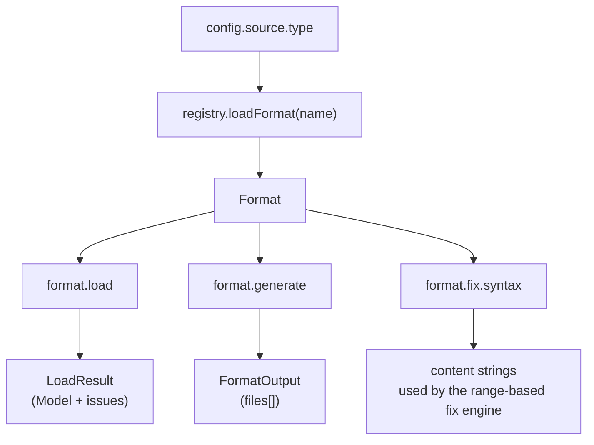

# Format API

The Format API is aact's single contract for every C4-as-code source
and IaC target. PlantUML, Structurizr, Kubernetes, Docker Compose,
model-json — they all sit behind the same `Format` interface declared
in [`types.ts`](./types.ts) and registered in
[`registry.ts`](./registry.ts).

A new format ships by adding **one entry** to the registry and a
directory under `src/formats/`. The rest of aact — `aact check`,
`aact analyze`, `aact diff`, `aact generate`, `aact view`,
`aact rule explain`, the `--fix` engine — discovers the new format
through the registry without core changes.

## What a Format is

```ts
interface Format {
  readonly name: string;
  readonly defaultPattern?: string | readonly string[];
  load?(path: string, options?: unknown): Promise<LoadResult>;
  generate?(model: Model, options?: unknown): FormatOutput;
  fix?: FixCapability;
}
```

Three capabilities are deliberately **optional**. A format declares
only what it can do — there are no stub methods that throw "not
implemented", no fake `read-only` / `write-only` subtypes. CLI and
library users narrow with type guards:

```ts
import { canLoad, canGenerate, canFix, loadFormat } from "aact";

const fmt = await loadFormat("structurizr");
if (canLoad(fmt)) {
  const { model, issues } = await fmt.load("workspace.dsl");
}
if (canGenerate(fmt)) {
  const output = fmt.generate(model);
}
```

| Field            | Required | Notes                                                                                                                                                          |
| ---------------- | -------- | -------------------------------------------------------------------------------------------------------------------------------------------------------------- |
| `name`           | yes      | Unique registry key. Used in `config.source.type` and CLI errors. lowercase, hyphenated.                                                                       |
| `defaultPattern` | no       | Glob (or array) for `aact init` scaffolding + path auto-detect. Single canonical name → string; multiple → `readonly string[]`.                                |
| `load`           | no       | `path → LoadResult`. Reads the source, produces a normalised `Model` + `ModelIssue[]`. **Throws** on hard failures (missing file, parse error). See below.     |
| `generate`       | no       | `Model → FormatOutput`. Pure synchronous render. Returns `{ files: GeneratedFile[] }` — single-file (PUML) or multi-file (k8s manifest per service) uniformly. |
| `fix`            | no       | `{ syntax: FormatSyntax }` content builders used by rule `fix` functions. Range-based — emits _new_ declarations only; the splicer (`applyEdits`) places them. |

## Capability combinations across the shipped formats

| Format        | load | generate | fix | `defaultPattern`                                                               |
| ------------- | ---- | -------- | --- | ------------------------------------------------------------------------------ |
| `plantuml`    | ✓    | ✓        | ✓   | `*.puml`                                                                       |
| `structurizr` | ✓    | ✓        | ✓   | `["workspace.json", "*.dsl"]`                                                  |
| `kubernetes`  | ✓    | ✓        |     | _none_ — auto-detect via directory inspection                                  |
| `compose`     | ✓    | ✓        |     | `["compose.yaml", "compose.yml", "docker-compose.yaml", "docker-compose.yml"]` |
| `model-json`  | ✓    | ✓        |     | `*.aact.json`                                                                  |

IaC formats (`kubernetes` / `compose`) deliberately drop `fix` —
manifests aren't authored by hand, range-based edits would land in
generated files. `model-json` drops `fix` for the same reason: JSON
has no meaningful range semantics for C4-level edits; the authoring
surface is PUML / DSL.

## How requests flow through the API



- `aact check` / `aact analyze` / `aact view` / `aact model` /
  `aact diff` call `load` and walk the resulting Model.
- `aact generate` calls `generate` with `{ model, options? }`.
- `aact check --fix` runs the model through the rule engine, collects
  `SourceEdit[]` from each fixable violation, and asks
  `format.fix.syntax` to render any **new** declarations needed
  (existing edits stay anchored on the source range).

## LoadResult contract

```ts
interface LoadResult {
  readonly model: Model;
  readonly issues: readonly ModelIssue[];
}
```

- **`model`** — fully populated. Element / Boundary / Relation lookups
  must work via `model.elements[name]` and `model.boundaries[name]`
  (the canonical record indexing). Loaders that find no elements still
  return an empty Model — they do NOT throw.
- **`issues`** — typed `ModelIssue[]` from `buildModel` (duplicate
  names, dangling refs) + format-specific findings (deployment block
  ignored, archetype gap, etc.). The CLI decides severity.
- **Hard failures throw.** Missing file, unrecoverable parse error,
  unsupported syntax → throw an `Error` with file context. The CLI
  envelope reports it as `exitCode: 2` (tool error).

## FormatOutput contract

```ts
interface FormatOutput {
  readonly files: readonly GeneratedFile[];
}
interface GeneratedFile {
  readonly path: string; // relative to caller's output dir
  readonly content: string;
}
```

Always an array — even for single-file formats like PUML. The CLI
sink resolver (`stdout` / `--output -` / `--output dir/`) iterates
uniformly without per-format dispatch.

## fix.syntax — content builders for the range-based fixer

The `--fix` engine never does text search-and-replace. It anchors
edits on `SourceLocation` ranges captured by the loader. The format
only needs to emit _new_ declarations when a rule's fix synthesises
them:

```ts
interface FormatSyntax {
  containerDecl(name: string, label: string, tags?: string): string;
  relationDecl(
    from: string,
    to: string,
    opts?: { description?: string; technology?: string; tags?: string },
  ): string;
}
```

`opts` is an object — callers don't pass `undefined` placeholders, and
new attributes (sprite, link, async marker) can land as additive
optional keys without breaking plugins. Future builders
(`boundaryDecl`, `propertyDecl`, …) plug in the same way.

## Per-format options

`load` and `generate` accept an opaque `options?: unknown` parameter.
Each format **types its own options shape** in its own module and
exposes it via `AactConfig.source.options` (discriminated by
`source.type`). Loaders that don't need options ignore the parameter.

Example (`kubernetes`):

```ts
// src/formats/kubernetes/types.ts
export interface KubernetesOptions {
  readonly annotationPrefix?: string;
  readonly namespaceAsBoundary?: boolean;
}
```

```ts
// aact.config.ts
export default defineConfig({
  source: {
    type: "kubernetes",
    path: "./k8s/",
    options: { annotationPrefix: "aact.io/" },
  },
});
```

## Registry

```ts
// src/formats/registry.ts
const formatLoaders = {
  plantuml: () => import("./plantuml").then((m) => m.plantumlFormat),
  structurizr: () => import("./structurizr").then((m) => m.structurizrFormat),
  "model-json": () => import("./model-json").then((m) => m.modelJsonFormat),
  kubernetes: () => import("./kubernetes").then((m) => m.kubernetesFormat),
  compose: () => import("./compose").then((m) => m.composeFormat),
};
```

Lazy `import()` per format keeps cold-start fast — unused formats
never load. **Registration order matters for auto-detect**: the first
matching `defaultPattern` wins. `structurizr` is listed before
`model-json` so a file named `workspace.json` resolves to Structurizr
(exact-basename match) before `*.aact.json` is consulted, even though
the patterns don't overlap today.

## Adding a new format

End-to-end checklist:

1. **Create the directory.** `src/formats/<name>/` with at minimum:
   - `index.ts` — exports `<name>Format: Format`
   - `load.ts` and/or `generate.ts` for the capabilities you implement
   - `types.ts` for `<name>Options` and any internal interfaces

2. **Implement the capabilities** you want to support. Read existing
   formats for conventions:
   - `plantuml/` — chevrotain parser with UTF-16 source ranges; a
     reasonable template for any token-based DSL.
   - `structurizr/` — parser + generator pair with archetype handling
     and round-trip parity tests.
   - `kubernetes/` and `compose/` — IaC loaders that emit
     `ModelIssue` for ignored manifest kinds.
   - `model-json/` — minimal load + generate, no parser.

3. **`load` source positions.** Every Element / Boundary / Relation
   the loader produces should carry a `sourceLocation` so rules can
   pin violations with a file:line:col anchor. Use UTF-16 code-unit
   offsets — matches chevrotain and LSP defaults.

4. **Register.** Add one line to `formatLoaders` in `registry.ts`.

5. **Add capability matrix row.** Open
   [`test/formats/registry.test.ts`](../../test/formats/registry.test.ts)
   and append a row to `CAPABILITIES_MATRIX`. The test suite enforces
   capability declarations vs. method presence — missing entry =
   failing test, surfacing the contract change in code review.

6. **Tests.**
   - `test/formats/<name>/load.test.ts` — fixture-based loader cases.
   - `test/formats/<name>/generate.test.ts` — if you implemented
     `generate`. Include a round-trip parity test
     (`parse(emit(model)) === model`) where applicable.
   - Property-based tests for option-bearing functions
     (`@fast-check/vitest`) — every branch must read the option, not
     a literal.

7. **Public API.** If users-as-library need direct access (option
   types, exported helpers), re-export from
   [`src/index.ts`](../index.ts).

8. **CHANGELOG.** Add an entry under `## Unreleased` describing the
   new format and its capabilities.

## Stability guarantees

- **Capability additions on the `Format` interface** (new optional
  methods) are non-breaking. Existing formats ignore them.
- **New optional fields on `FormatSyntax`** are non-breaking. Plugins
  using older Syntax helpers keep working.
- **Removing or renaming a capability** is breaking. Bumps the major
  version of aact.
- **`LoadResult` / `FormatOutput` shape** is part of the public
  contract — additive changes only. Renaming `model` / `issues` /
  `files` requires a major bump.
- **Registry name changes** are breaking — users have
  `config.source.type: "..."` pinned in their projects.

The Format API is the **stable extension point** for plugin formats
(LikeC4, Mermaid C4, custom in-house DSLs). aact treats it as a
public contract — the rest of `src/` may refactor, the surface here
is locked.
