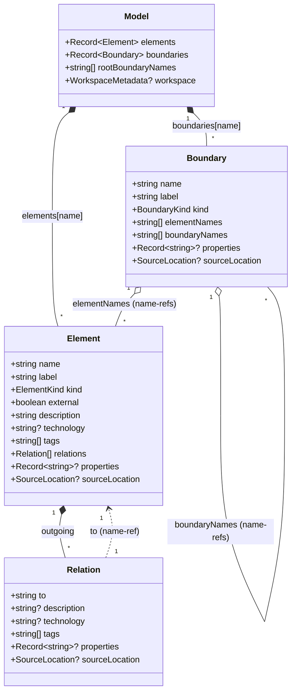
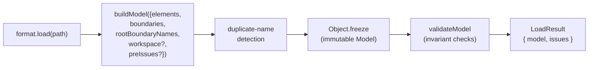
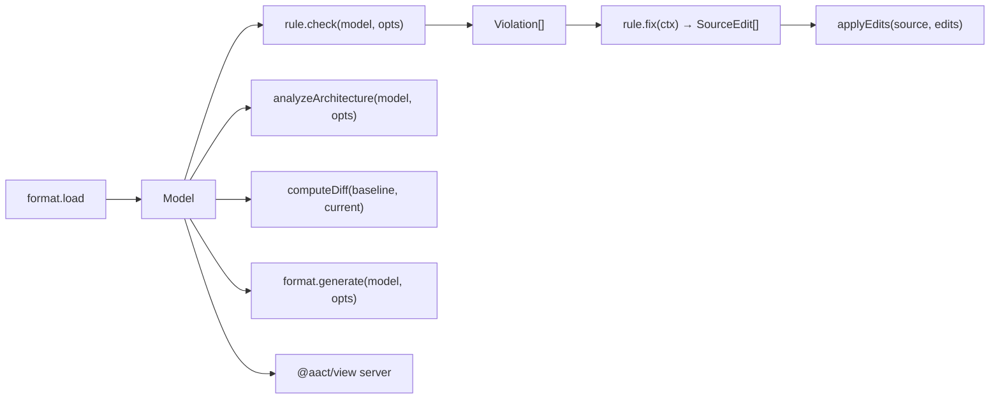

# Model

The canonical C4 graph aact lints, analyzes, diffs, generates, and
renders. Every format loader produces a `Model`; every rule, analyzer,
generator, and the browser view consume it. The Model is the **single
intermediate representation** between sources (PUML, DSL, k8s, compose,
JSON) and outputs (violations, metrics, diagrams, manifests).

A new format ships by producing this shape — no other coupling
exists. The Model contract is described in detail in
[`types.ts`](./types.ts); this README explains how the pieces fit
together and how to consume / produce one safely.

## What's in the Model

```ts
interface Model {
  readonly elements: Readonly<Record<string, Element>>;
  readonly boundaries: Readonly<Record<string, Boundary>>;
  readonly rootBoundaryNames: readonly string[];
  readonly workspace?: WorkspaceMetadata;
}
```

| Field               | Notes                                                                                                                                                                                             |
| ------------------- | ------------------------------------------------------------------------------------------------------------------------------------------------------------------------------------------------- |
| `elements`          | `Record<name, Element>` — O(1) lookup by identifier. The same `name` is the identifier in source DSL (`api = container "API"` registers `name: "api"`).                                           |
| `boundaries`        | `Record<name, Boundary>` for grouping containers/components. Structurizr `softwareSystem { ... }` blocks land here when they have children; leaf systems land as `Element` with `kind: "System"`. |
| `rootBoundaryNames` | Top-level boundaries; the rest nest via `Boundary.boundaryNames`. Drives the View's hierarchy navigation and Model serialization order.                                                           |
| `workspace`         | Optional metadata from Structurizr `workspace "name" "description" extends "..."` headers. Formats without a workspace header omit it.                                                            |

The Model is **immutable** (`Object.freeze` on `elements`, `boundaries`,
and `rootBoundaryNames`) after `buildModel` returns. Every reference
inside the graph is a **name-ref**, not an object reference —
`Relation.to` is a string, not an `Element`. This breaks the
Element↔Relation cycle, makes the Model serialisable (`JSON.stringify`
works natively), and keeps test fixtures readable
(`relations: [{ to: "db" }]` instead of object literals).

## Core types



`ElementKind` covers the full C4 stdlib set:

```
Person · System · Container · ContainerDb · ContainerQueue ·
Component · ComponentDb · ComponentQueue
```

`Element.external: boolean` is **orthogonal** to kind — replaces all
`*_Ext` variants from earlier aact versions. Maps cleanly to the eight
PlantUML `*_Ext` macros via a single flag.

`BoundaryKind` covers `System · Container · Component · Enterprise`.
`Enterprise` is loader-only (Structurizr's `enterprise` was removed
upstream; we keep the kind for round-trip from older fixtures).

## Source locations

Every Element / Boundary / Relation may carry a `sourceLocation`
captured by the loader:

```ts
interface SourceLocation {
  readonly file: string;
  readonly start: SourcePosition; // { line, col, offset }
  readonly end: SourcePosition;
}
```

- `line` / `col` — 1-based (matches editor conventions and OSC 8 terminal
  links).
- `offset` — **0-based UTF-16 code-unit index** into the source string.
  Same unit `String.prototype.slice` operates on, what chevrotain
  emits, and what LSP uses by default. **Not** UTF-8 bytes despite the
  field name — cyrillic / emoji / CJK round-trip correctly because
  every producer and consumer uses the same unit.
- `end` is the position **after** the last character of the parsed
  construct (half-open interval).

Regex-based loaders may omit `sourceLocation` entirely. When present,
it must be complete (no placeholder fills) — that contract is what
makes range-based `--fix`, OSC 8 hyperlinks, and `aact diff` patch
output possible.

## How a Model gets built



`buildModel` is the **single entry point** every loader uses. It
guarantees four things:

1. **Duplicate-name detection** before `Record` insertion — instead of
   silent overwrite (the default `Record` behaviour), the second
   insert becomes a `duplicate-element-name` / `duplicate-boundary-name`
   issue.
2. **Sorted insertion order** by name — deterministic output for JSON
   snapshot tests and diff-friendly serialisation.
3. **Immutability** — `Object.freeze` on `elements`, `boundaries`,
   `rootBoundaryNames`. Once a Model is built, no code can mutate it
   accidentally.
4. **Full `validateModel` pass** for structural invariants.
   `preIssues` from the loader (parse errors, hard-removed constructs)
   merge with validation issues into a single ordered list.

Tests can build a Model from object literals when convenient, but
going through `buildModel` is the canonical path — it's what loaders
use, and it's what enforces invariants.

## Invariants `validateModel` checks

`validateModel(model)` runs a single O(V + E) pass over the graph and
emits `ModelIssue[]`. The full list of issue kinds:

| Kind                               | What it means                                                                                                                                                  |
| ---------------------------------- | -------------------------------------------------------------------------------------------------------------------------------------------------------------- |
| `dangling-relation`                | `Relation.to` doesn't exist in `model.elements`. Usually a typo in source.                                                                                     |
| `element-in-boundary-not-in-model` | Boundary lists an `elementNames` entry that's not in `model.elements`. Loader bug or hand-built test fixture.                                                  |
| `boundary-not-in-model`            | A child boundary referenced by `boundaryNames` is missing from `model.boundaries`.                                                                             |
| `boundary-cycle`                   | DFS found a cycle in the boundary tree. The full path is in the issue payload.                                                                                 |
| `duplicate-element-name`           | Two elements registered with the same name. Captured at loader-side (before `Record` overwrite); the type is in the union so loaders can emit it consistently. |
| `duplicate-boundary-name`          | Same as above for boundaries.                                                                                                                                  |
| `duplicate-identifier`             | Two distinct elements registered under the same DSL identifier (`api = container "X"` then `api = container "Y"`). Reference Structurizr throws; we report.    |
| `self-relation`                    | `Relation.to === source.name`. Surfaced separately so the cycle finder in `aact analyze` can exclude self-loops from distributed-monolith detection.           |
| `unknown-kind`                     | Element carries a `kind` outside the declared `ElementKind` union. Format bug; should never reach `validateModel` in practice.                                 |
| `loader-warning`                   | Generic format-specific warning that doesn't fit the fixed kinds (`source: "compose"`, `code: "version-obsolete"`, `message: "..."`).                          |

The CLI maps these to severity: dangling / duplicate / cycle → fail;
unknown-kind / self-relation / loader-warning → warn. Issues are
visible in `aact check --json` / `--sarif` envelopes and in the
view's loader-issues sidebar.

## Helpers (`lib.ts`)

Pure name-ref lookups and graph helpers — no mutation, no I/O:

| Helper                     | Use                                                                                                                                       |
| -------------------------- | ----------------------------------------------------------------------------------------------------------------------------------------- |
| `getElement(model, name)`  | O(1) Element lookup by name. Returns `undefined` for dangling refs.                                                                       |
| `getBoundary(model, name)` | O(1) Boundary lookup.                                                                                                                     |
| `targetOf(model, rel)`     | Resolve `Relation.to` to the target Element. The dominant pattern in rules: `isDatabaseElement(targetOf(model, rel))`.                    |
| `isDatabaseElement(el)`    | `true` when `el.kind` is `ContainerDb` or `ComponentDb`. Single source of truth across analyze, rules, k8s generator.                     |
| `isDatabaseKind(kind)`     | Kind-only predicate when you don't have the full Element.                                                                                 |
| `allElements(model)`       | `Object.values(model.elements)` — flat iteration for `.filter` / `.map` callers.                                                          |
| `allBoundaries(model)`     | Same for boundaries.                                                                                                                      |
| `walkBoundaries(model)`    | Depth-first iterator from `rootBoundaryNames` inward. Guards against accidental cycles (`validateModel` reports them, walker stays safe). |
| `formatLocation(loc)`      | Canonical `<file>:<line>:<col>` string for diagnostics, GitHub annotations, JSON renderers.                                               |

These helpers are exported from the public package (`src/index.ts`),
so users-as-library can write rules and analyzers without touching
Model internals.

## How rules and analyzers consume the Model



- **Rules** (`crud`, `acl`, `acyclic`, `apiGateway`, `cohesion`,
  `commonReuse`, `dbPerService`, `stableDependencies`, plus user rules)
  take `(model, options)` and return `Violation[]` carrying a
  `target` name + `targetKind` + a `SourceLocation`-anchored range.
- **Analyzer** (`analyzeArchitecture`) computes cohesion/coupling per
  boundary, sync/async breakdown, fan-in/out top-N, and Tarjan SCC
  cycles. Used by both `aact analyze` and the view's Analyze overlay.
- **Diff** (`computeDiff`) compares two Model snapshots with rename
  detection and pair-collapse for technology swaps.
- **Generators** (`plantuml`, `structurizr`, `kubernetes`, `compose`,
  `model-json`) produce `FormatOutput` from the same Model. The
  Structurizr generator round-trips (`parse(emit(model)) === model`)
  to validate parser fidelity.
- **View** subscribes to a server WebSocket pushing fresh envelopes
  on every source save.

## Stability guarantees

The Model is a **stable public contract**:

- **Adding optional fields** to Element / Boundary / Relation /
  Model / WorkspaceMetadata is non-breaking. Loaders that don't know
  about the new field omit it; consumers ignore missing optional
  fields.
- **Adding new `ElementKind` / `BoundaryKind` literals** is
  non-breaking. Existing rules' switch statements handle unknown
  kinds gracefully (`unknown-kind` issue).
- **Adding new `ModelIssue` kinds** is non-breaking for callers that
  use `kind` as a discriminator with a default branch — the standard
  pattern in `src/cli/output/`.
- **Removing or renaming a field** is breaking. Bumps the major
  version of aact.
- **Changing semantic meaning** of an existing field is breaking
  (e.g. redefining `Element.external` from boolean to a string union
  would silently miscount external systems in every rule).

When you add a format and need a Model concept that doesn't exist
yet — open an issue first. The Model is shared by every format, every
rule, every analyzer; extensions should be discussed before a PR
lands a new optional field.

## What's deliberately out of scope

- **Deployment view** — node / container instance / health check.
  System Architect / kube-score territory, not Solution Architect's
  C4 surface. Structurizr deployment blocks parse-then-info-issue;
  the Model doesn't carry them.
- **ArchiMate / UML / BPMN concepts** — different modelling paradigms;
  aact is strictly C4.
- **Workspace `properties { ... }` and `version` fields** — Structurizr
  styling / layout hints, no linter relevance. If a future rule needs
  them, the type extends additively.

Keeping the Model narrow is what lets every format share it without
clashing semantics — the price is that some format features round-trip
through `Element.properties` / `Relation.properties` rather than as
first-class fields (`async` tag, `group` membership, `perspective.<name>`
keys).
