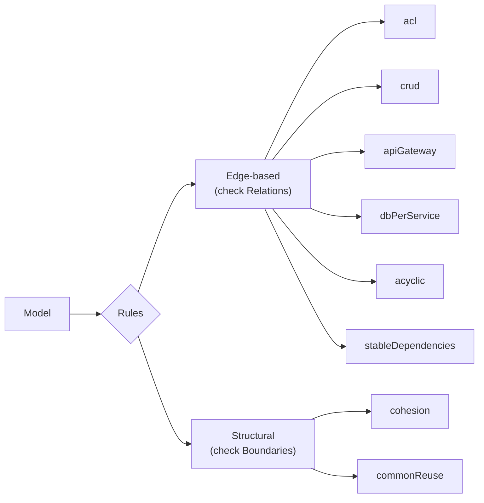
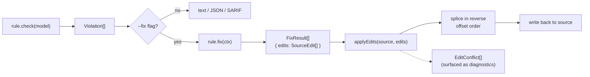
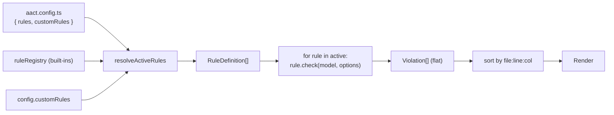

# Rules

Architectural rules that aact applies to a `Model`. Each rule
encodes one constraint — _"databases must be accessed only through a
repo"_, _"ACL containers must route external calls through an API
Gateway"_, _"each boundary should be more cohesive than coupled"_ —
and returns a list of violations the user / agent can act on.

A built-in rule is **one file** at `src/rules/<name>.ts` exporting a
single `RuleDefinition` object. User-defined custom rules
([`examples/custom-rules/`](../../examples/custom-rules/)) use the
exact same contract — there is no second interface for "plugins".

## What a Rule is

```ts
interface RuleDefinition<O = unknown> {
  readonly name: string;
  readonly description: string;
  readonly rationale?: string;
  readonly examples?: readonly RuleExample[];
  readonly adrPath?: string;
  check(model: Model, options?: O): readonly Violation[];
  fix?(ctx: FixContext<O>): readonly FixResult[];
}
```

| Field         | Required | Notes                                                                                                                                                                                                                                                                       |
| ------------- | -------- | --------------------------------------------------------------------------------------------------------------------------------------------------------------------------------------------------------------------------------------------------------------------------- |
| `name`        | yes      | Unique key. Used in CLI selection (`aact check --rules crud,acl`), violation rendering, and `aact rule explain <name>`. lowercase, hyphenated for multi-word names (`stableDependencies`).                                                                                  |
| `description` | yes      | One-liner — fits in a table row. Shown by `aact rule list` and on every violation header.                                                                                                                                                                                   |
| `rationale`   | no       | 1–3 paragraphs — _why_ this rule exists. Surfaced via `aact rule explain <name>`; AI agents use it as context when proposing fixes. Plain prose, no markdown frills.                                                                                                        |
| `examples`    | no       | `{ label: "good" \| "bad", source, note? }[]` — short illustrative snippets. Helps human readers and agents see the pattern in <10 lines without opening the ADR.                                                                                                           |
| `adrPath`     | no       | Path (relative to repo root) to a longer architecture decision record. Resolved by `aact rule explain` to a Cmd-clickable hyperlink.                                                                                                                                        |
| `check`       | yes      | The actual rule. Takes the Model + options, returns `Violation[]`. Pure function — no I/O, no logging at default verbosity. Must be deterministic so `--fix` re-checks converge.                                                                                            |
| `fix`         | no       | Optional auto-fix. Takes `FixContext<O>` (model + violations + format syntax + options), returns `FixResult[]` carrying `SourceEdit[]`. Range-based — anchors on `SourceLocation`s from the loader; never does text search. See [`lib/applyEdits.ts`](./lib/applyEdits.ts). |

`O` is the rule's options type. `defineRule<const T>` preserves the
literal `name` so `defineConfig`'s mapped type can propagate
autocomplete to `aact.config.ts`'s `rules: { ... }`.

## Built-in rules



| Rule                 | Fires on              | Fix? | ADR | What it enforces                                                                                           |
| -------------------- | --------------------- | ---- | --- | ---------------------------------------------------------------------------------------------------------- |
| `acl`                | Element (calling out) | ✓    | ✓   | Containers calling external systems must be tagged as ACL (Anti-corruption Layer).                         |
| `acyclic`            | Element (in cycle)    |      |     | Dependency graph between containers must be acyclic — Tarjan SCC.                                          |
| `apiGateway`         | Element (ACL caller)  |      |     | ACL containers calling external systems must route through an API Gateway.                                 |
| `cohesion`           | Boundary              |      |     | Each boundary should be more cohesive than coupled; parent boundaries less cohesive than inner ones.       |
| `commonReuse`        | Boundary              |      | ✓   | Consumers using part of a boundary's public surface should use all of it.                                  |
| `crud`               | Element (DB accessor) | ✓    | ✓   | Direct database access only through repo/relay containers; repos must access databases only.               |
| `dbPerService`       | Element (Database)    | ✓    | ✓   | Each database container must have a single owner (one repo/relay per DB).                                  |
| `stableDependencies` | Element               |      |     | Dependencies should point toward more stable containers (instability calculation, Robert C. Martin's SDP). |

The order in [`registry.ts`](./registry.ts) determines default CLI
output order. Adding a rule = one `import` line + one entry in the
array, nothing else.

## Violation contract

```ts
interface Violation {
  readonly target: string;
  readonly targetKind: "element" | "boundary";
  readonly message: string;
  readonly sourceLocation?: SourceLocation;
  readonly relatedLocations?: readonly RelatedLocation[];
}
```

- **`target` + `targetKind`** — the offending node + which lookup
  table to read it from. Consumers (text renderer, SARIF reporter,
  view) never have to guess; `targetKind: "boundary"` reads from
  `model.boundaries`, `"element"` from `model.elements`.
- **`message`** — human-readable. Should include the target name and
  the specific reason ("Container 'orders' accesses 'ordersDb' directly
  without a repo").
- **`sourceLocation`** — primary anchor. The offending edge for
  edge-based rules; the offending element/boundary declaration for
  structural rules. Optional but **strongly recommended** — without
  it, `aact check --fix` can't auto-apply edits, OSC 8 hyperlinks in
  the terminal don't work, and SARIF annotations land on line 1 of
  the file.
- **`relatedLocations`** — secondary anchors with optional labels
  (`"accessor"`, `"in cycle"`, `"external system"`). Maps natively to
  SARIF `result.relatedLocations[]`; rendered in text mode as
  indented `↳ <message>: <file>:<line>:<col>` lines. Used by
  `dbPerService` to surface every accessor on a multi-owner DB,
  `acyclic` to list cycle members, `acl` to point at the foreign
  system.

## Fix contract

```ts
interface FixContext<O = unknown> {
  readonly model: Model;
  readonly violations: readonly Violation[];
  readonly syntax: FormatSyntax;
  readonly options: O | undefined;
}

interface FixResult {
  readonly rule: string;
  readonly description: string;
  readonly edits: readonly SourceEdit[];
}

type SourceEdit =
  | { kind: "replace"; range: SourceLocation; content: string }
  | { kind: "remove"; range: SourceLocation }
  | { kind: "insert-after"; anchor: SourceLocation; content: string }
  | { kind: "insert-before"; anchor: SourceLocation; content: string };
```

The fix engine is **range-based, not pattern-based**. Rules emit
`SourceEdit[]` anchored on `SourceLocation`s from Model nodes; the
applier (`lib/applyEdits.ts`) is a pure string splicer with conflict
detection — never re-matches text, never re-parses.



Each rule with `fix?` typically pairs a check-violation with one or
more edits:

- **`acl`** — tag the offending container with `"acl"`.
- **`crud`** — insert a synthetic repo container between accessor and
  database (uses `syntax.containerDecl` + `syntax.relationDecl`), or
  remove non-database relations from a repo.
- **`dbPerService`** — rewire secondary accessors through the
  designated repo.

The `syntax: FormatSyntax` field carries format-specific content
builders (`containerDecl`, `relationDecl`) so the same rule fix works
for PUML, Structurizr DSL, and any future format that ships a
`FormatSyntax`.

## How a check runs end-to-end



- **Built-ins** live in [`registry.ts`](./registry.ts).
- **Custom rules** plug in via `config.customRules: RuleDefinition[]`;
  no separate plugin loader, no API for "plugin authors" — same
  interface, same defineRule helper.
- **Selection / options** come from `config.rules`. A rule can be
  fully disabled (`rules.crud: false`), enabled with default options
  (`rules.crud: true` / omitted), or enabled with custom options
  (`rules.crud: { repoNamePatterns: ["*-repo"] }`). The mapped type
  on `defineConfig` propagates the option shape from each
  `RuleDefinition<O>` so options autocomplete in the IDE.

## Helpers (`lib/`)

Shared utilities every rule reads, kept out of `lib.ts` so the model
module stays focused on the graph and the rule helpers can evolve
independently:

| Helper                                      | Use                                                                                                                                                                                                                                                                                                                                       |
| ------------------------------------------- | ----------------------------------------------------------------------------------------------------------------------------------------------------------------------------------------------------------------------------------------------------------------------------------------------------------------------------------------- |
| [`applyEdits`](./lib/applyEdits.ts)         | Pure splicer for `SourceEdit[]`. Sorts in reverse offset order, detects overlaps as `EditConflict[]`, returns the new source string. Never re-matches text.                                                                                                                                                                               |
| [`boundaryUtils`](./lib/boundaryUtils.ts)   | Parent/child walking, "same-boundary-as" predicates. Edge-based rules use these to detect cross-boundary relations.                                                                                                                                                                                                                       |
| [`namingPatterns`](./lib/namingPatterns.ts) | picomatch globs with brace expansion. Powers `*NamePatterns` options on `acl` / `apiGateway` / `crud` / `dbPerService` — lets rules infer roles (`"*-repo"`, `"{api,gateway}-*"`) from naming conventions when explicit tags are missing. Real-world AI-generated and legacy diagrams rarely have clean tags; name patterns fill the gap. |
| [`namingUtils`](./lib/namingUtils.ts)       | Lower-level helpers — singularization, suffix stripping (`"-service"`, `"-controller"`). Used by `crud` to derive a default repo name from an accessor name (`orders` → `ordersRepo`).                                                                                                                                                    |

## Adding a new rule

End-to-end checklist:

1. **Decide the scope.** What constraint does the rule enforce, on
   which level (element / boundary), with what evidence
   (relations / properties / structure)? If the rule needs new Model
   fields, open an issue first — the Model is the shared contract.

2. **Create the file.** `src/rules/<name>.ts` exporting a single
   `RuleDefinition` object. Inline `check`; inline `fix` if you have
   one. **Do not** create `rules/<name>/` subdirectories or split
   `check.ts` / `fix.ts` apart — one rule = one file.

3. **Write the rationale.** 1–3 paragraphs explaining _why_, not
   _how_. Read existing rules' `rationale` for tone (`crud.ts`,
   `acl.ts`, `commonReuse.ts` are good references). The rationale
   feeds `aact rule explain`; AI agents lean on it heavily.

4. **Add good/bad examples.** Short PUML or DSL snippets. Both
   formats land in the explain output; pick the one that's easier to
   read for the constraint.

5. **Source locations.** Set `sourceLocation` on every Violation —
   use the element's own `sourceLocation`, the offending relation's,
   or the boundary's. Without it `--fix` can't apply edits and
   terminal-link OSC 8 hyperlinks don't render.

6. **Options type.** If your rule has tunables, declare the shape as
   an exported interface (`<RuleName>Options`) and pass it as the
   generic parameter to `RuleDefinition<O>` / `defineRule`. The mapped
   type on `defineConfig` propagates the shape to the user's config.

7. **Register.** Add an `import` line + entry to
   [`registry.ts`](./registry.ts).

8. **Re-export.** Add to [`index.ts`](./index.ts) and
   [`src/index.ts`](../index.ts) so users-as-library can consume the
   rule + its options type directly.

9. **Add config schema row.** Open [`src/config.ts`](../config.ts)
   and add the rule + its options shape to both:
   - The valibot schema (`AactConfigSchema`)
   - The `BuiltinRulesConfig` interface

10. **Tests.**
    - `test/rules/<name>.test.ts` — fixture-based check cases.
    - `test/rules/<name>.fix.test.ts` — if you implemented `fix`.
    - **Property-based** test for every option (`@fast-check/vitest`)
      that flips the default value and asserts behaviour changes.
      Hardcoded literals where the option should be read are the bug
      class these tests catch.

11. **ADR.** If the rule encodes a non-trivial pattern (CRUD
    boundaries, Anti-corruption Layer, Common Reuse), add an ADR in
    [`ADRs/`](../../ADRs/) and reference it via `adrPath`.

12. **CHANGELOG.** Add an entry under `## Unreleased` describing the
    new rule.

## Determinism, purity, performance

- **Pure functions.** `check` and `fix` take Model + options and
  return arrays — no I/O, no global state, no logging at default
  verbosity. CLI / library users can call them safely in parallel
  contexts.
- **Deterministic order.** Violations from a given check call should
  appear in a stable order (typically source-location order or
  alphabetical by `target`) so `--fix` re-checks converge and JSON
  snapshots stay stable.
- **No mutation.** Don't mutate Model nodes. Both the Model and its
  arrays are frozen; mutation throws in strict mode and silently
  diverges per-rule otherwise. Build new arrays / objects when you
  need them.
- **Performance.** On real-world C4 graphs (V ≤ 5000) every rule runs
  in <10ms per check (`memory/project_perf_baseline`). The rule
  engine's `O(B·R)` boundary-relation loop in `check.ts` is the only
  point to think about for huge models — individual rules don't need
  optimisation.

## Stability guarantees

- **Adding optional fields** to `RuleDefinition` / `Violation` /
  `FixContext` / `SourceEdit` is non-breaking.
- **Adding new built-in rules** is non-breaking. The CLI honours
  `config.rules[name]: false` to opt out.
- **Renaming or removing a built-in rule** is breaking — users have
  `config.rules.<name>` pinned in their projects. Bumps the major
  version.
- **Changing a rule's default behaviour** (turning a previously
  not-fired condition into a violation) is breaking. Either ship a
  new rule or gate the new check behind a non-default option.

The rule contract is the **stable extension point** for in-house
architectural standards. Custom rules use the same shape, so they're
unaffected by core refactors — anything that breaks a custom rule
breaks a built-in too, and that's a documented major bump.
